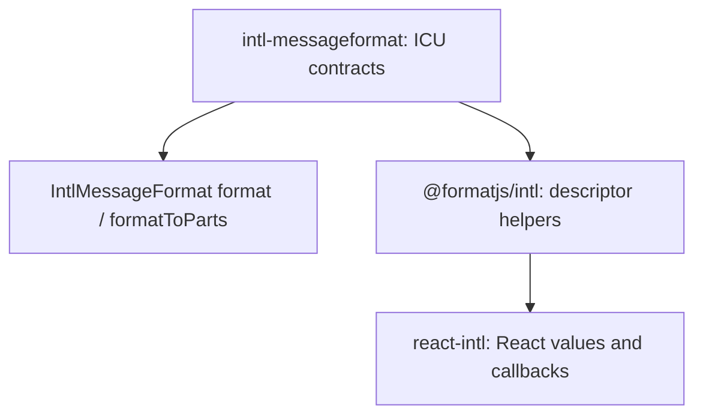

# @formatjs/intl & Framework Integrations

## intl-messageformat

**Purpose:** High-level ICU MessageFormat formatter. Takes a message string + locale + values, returns formatted output.

- Parses messages via `@formatjs/icu-messageformat-parser`
- Formats using native `Intl` APIs (NumberFormat, DateTimeFormat, PluralRules)
- Memoizes formatter instances via `@formatjs/fast-memoize`
- Ships an IIFE bundle (`intl-messageformat.iife.js`) for browser `<script>` tag usage
- BSD-3-Clause licensed (not `@formatjs` scoped for historical reasons)

The low-level Rust runtime lives at `crates/icu_messageformat` as
`formatjs_icu_messageformat`. It reuses the Rust parser AST and ICU4X. Messages
are parsed without a locale, then formatted with a request locale.

## @formatjs/intl

**Purpose:** Main FormatJS package aggregating all formatting APIs into a single coherent interface.

**Key exports:**

- `createIntl(config)` — Create an intl instance (framework-agnostic)
- `defineMessage(s)` — Message descriptor helpers (for extraction tooling)
- `formatMessage`, `formatDate`, `formatNumber`, `formatDisplayName`, `formatList`, `formatPlural`, `formatRelativeTime`, `formatDuration`, `formatDurationToParts`

**Design:** Framework-agnostic core that `react-intl`, `vue-intl`, and `svelte-intl` all build upon. The framework packages add reactive bindings and components but delegate all formatting to `@formatjs/intl`.

`formatDuration` and `formatDurationToParts` use optional native
`Intl.DurationFormat` (or a consumer-loaded polyfill), the shared duration
formatter cache, and `formats.duration` named options. Failures go through
`onError` and return an empty string or parts array. Public duration declarations
reuse structural types shared with the duration polyfill in `ecma402-abstract/types/duration.ts`, so
consumers do not need TypeScript's native `Intl.DurationFormat` declarations.

The Rust mirror lives at `crates/formatjs_intl` as `formatjs_intl`. It keeps
`Intl` request-scoped, while `MessageCatalog` and `IntlCache` can be shared by
the backend. ICU4X negotiates each ordered locale list against available
catalogs. Translation lookup falls back to the default catalog, then the
descriptor default message. `message_descriptor!` generates missing IDs with
`[sha512:contenthash:base64:10]` and is extracted from Rust source by
`formatjs_cli`. `format_message!` provides the same extraction and ID behavior
for inline calls, returns `String`, and uses the descriptor default verbatim if
cache infrastructure fails. Inline `values: { name: expression }` are converted
to runtime values and checked against the default ICU message at compile time;
callers can still pass an existing values map.

`formatted_message!` is the opt-in checked-text interface. It returns the opaque
`formatjs_intl::FormattedMessage` and accepts only formatted messages,
domain-owned verbatim arguments, numbers, booleans, and dates through sealed
`MessageArgument` conversions. `MessageValues` provides checked reusable maps.
There is no raw-string constructor. Applications implement `VerbatimSource` on
domain types with controlled constructors; `Verbatim::new(&source)` borrows them
for interpolation only. Strings, paths, and arbitrary `Display` values have no
built-in implementation, and `Verbatim` cannot convert to `FormattedMessage`.
Reviewing domain trait implementations remains an application responsibility. Static-descriptor callers use `Intl::format_message_typed` or
`format_message_typed_or_default`. All paths reuse the existing formatter and
fallback chain. The CLI extracts both inline macros with identical ID rules.
The type does not promise translation coverage, escaping, or successful
interpolation, and is distinct from the low-level rich-text result of the same
name. Locale selection and domain error presentation remain application-owned.

## react-intl

**Purpose:** React components and hooks for i18n. The most widely used FormatJS package.

**Components:**

- `<IntlProvider>` — Context provider for locale/messages
- `<FormattedMessage>` — Render ICU MessageFormat strings
- `<FormattedNumber>`, `<FormattedDate>`, `<FormattedTime>`, `<FormattedList>`, `<FormattedDisplayName>`, `<FormattedPlural>`, `<FormattedRelativeTimeFormat>`

`<FormattedDuration>` and `<FormattedDurationParts>` delegate to the core duration
APIs and respect provider locale, named formats, and explicit options. The
imperative methods are available through `useIntl()` and both `createIntl`
entry points; `FormatDurationOptions` is exported from the client and server.

**Hooks:**

- `useIntl()` — Access intl object for imperative formatting

**Design decisions:**

- React 19 peer dependency (latest only)
- Server-side rendering support via `/server` export
- Separate `defineMessage(s)` re-exported for extraction compatibility
- Global type override support for strict message typing

**Peer deps:** `react@19`, `@types/react@19`

## vue-intl

**Purpose:** Vue 3 integration for FormatJS.

- Provides Vue composables wrapping `@formatjs/intl`
- Peer dep: `vue@^3.5.0`

## @formatjs/svelte-intl

**Purpose:** Svelte 5 integration for FormatJS.

- Provides Svelte stores/context wrapping `@formatjs/intl`
- Peer dep: `svelte@^5.0.0`

## @formatjs/editor

**Purpose:** Headless ICU MessageFormat editing and translation workflows for React 19.

- `useMessageEditor`, `Editor`, and `Message` expose editing and parsing without DOM or styling.
- `useTranslationEditor` adds validation, navigation, and shared drafts keyed by message and locale. `getTranslation(id, locale)` lets independently mounted views use one workflow's state.
- `save(context?)` returns a typed saved, failed, invalid, or skipped outcome. `onSave(update, snapshot)` receives source/baseline metadata and opaque caller context, and may return a typed persistence receipt.
- The published entry point depends on React and `icu-messageformat-parser`; consumers own persistence, design systems, and localization providers. The StyleX/React Intl demo is repository-only.
- `@formatjs/editor/ui` separately exports controlled `TranslationEditorView`, `MessageList`, `SourceMessage`, and `TranslationField` components. `EditorDesignSystemProvider` configures typed controls/layout once per tree; views and custom consumers retrieve them through `useEditorDesignSystem()`. Nested overrides inherit parent components, with native defaults outside a provider. Explicit per-component props and semantic callbacks share accessibility wiring without adding StyleX or React Intl dependencies. The workflow demo consumes this API with its own StyleX adapter.
- Generic `MessageList`/`TranslationEditorView` row renderers preserve consumer metadata and keep secondary actions outside the selection control. List summaries, explicit selected IDs, content/locale wrappers, empty states, per-locale label overrides, and a layout sidebar let consumers use the composed view without rebuilding its wiring.
- `LocalePicker`, `MessagePreview`, `CopyTextButton`, and `MessageContext` share the public design-system context. Optional typed tool adapters resolve to native defaults, preserving existing registries. Locale selection stays controlled; preview preserves ICU branches/skeletons without executing tags; clipboard feedback ignores obsolete writes; metadata uses the existing message/source-location types. See `demo/tools-demo.tsx` and browser `/?tools=1`.
- Views accept loaded lists, search callbacks, selected detail, and per-locale drafts; fetching, pagination controls, confirmation, and persistence remain caller-owned.
- See `packages/editor/README.md` for state lifetime, submission snapshots, adapter contracts, and examples.

## Opt-in ICU argument contracts

These APIs require TypeScript 5.4 or newer. Descriptor overloads use its
`NoInfer` intrinsic to prevent value maps from weakening the message contract.

`intl-messageformat/message-types.ts` owns `MessageContract`, `MessageValue`,
`MessageTag`, value resolution, and required-argument tuples. The generic
`IntlMessageFormat<Values>` checks both `format` and `formatToParts` for string
and AST inputs. Omitting the generic preserves the original signatures.



### Descriptor adapters

`defineMessage<Values>(descriptor)` and
`defineMessages<Contracts>(catalog)` attach phantom contracts for
`formatMessage` and `$t`. Existing one-argument overloads retain their behavior.
`MessageValue` represents plain arguments; `MessageTag` is resolved to the
formatter's callback type. Contracts are explicit; TypeScript does not parse
the ICU string. The original helper overload stays last to preserve
`Parameters` and `ReturnType` for wrappers. React helpers retain their original
`MessageDescriptor` constraint.
Checks require retaining `TypedMessageDescriptor`; widening to
`MessageDescriptor` intentionally loses the contract. JSX and ID-only catalog
inference are outside this API.

Inline `formatMessage<Values, RichOutput>` and `$t<Values, RichOutput>` use an
explicit ICU contract without branding the descriptor. The first generic
replaces the previous rich-output position; the second defaults to the
formatter's rich-value type. Inline overloads default the contract to `never`
and block inference from values, so calls without generics stay on untyped
signatures. Typed helper descriptors retain their inferred contract overloads.

No-generic plain descriptors do not infer ICU arguments from literals; normal
descriptor/value validation and runtime error handling still apply. Typed helper
descriptors enforce their carried contract without call-site generics. Rich output
defaults to ReactNode in React Intl or createIntl<T>'s base type in core Intl
(string by default). Untyped rich calls use that base output type. React Intl
declares `$t` as `IntlShape['formatMessage']` so the alias also uses React's
rich-text callback inference and return types instead of inheriting the core
overloads independently.

The opt-in `enforce-message-types` ESLint rule generates and refreshes these
contracts from the ICU parser for static helper calls and formatter constructors.
It supports local const descriptors with non-escaping uses, computed catalog keys,
and referenced descriptors via `MessageValuesOf<typeof descriptor>`. Catalog
annotation migration resolves local type aliases and removes type-only bindings
made unused by a fix, while preserving exported aliases and remaining uses.

Optional contract properties stay optional after resolving scalar and tag types.
The values argument can be omitted when every property is optional. This supports
the ESLint ignoreList option without weakening required properties.

### Readonly message helpers

`defineMessage` returns a readonly descriptor. `defineMessages` returns a readonly
catalog of readonly descriptors, including calls without typed options. Construct
a new descriptor or catalog instead of mutating a helper result. This is a
TypeScript breaking change; helpers preserve object identity and do not freeze
objects or recursively transform rich values.

### Typed helper metadata

Typed helpers retain required `id` and `defaultMessage` fields for common
descriptor shapes. Catalog inference retains fields shared by every entry.
For literal IDs, custom metadata, or heterogeneous catalogs, supply a second
descriptor generic: `defineMessage<Values, typeof descriptor>(descriptor)`
or `defineMessages<Contracts, typeof catalog>(catalog)`.
TypeScript cannot partially infer that second generic after an explicit first one.
ESLint refreshes the ICU generic while preserving the metadata generic.

### Typed FormattedMessage

Spreading a typed descriptor into `FormattedMessage` now checks its `values`:
`<FormattedMessage {...messages.count} values={{count: 2}} />`.
Required ICU arguments require the values prop, and rich tags require callbacks
returning React nodes. Argument-free descriptors can omit values. Ordinary
untyped JSX remains permissive. Keep the descriptor's phantom contract when
passing it through wrappers; widening to MessageDescriptor erases the check.
Runtime rendering, memoization, and children callbacks are unchanged.

`MessageTag` values contextually type inline rich-text callback parameters as
`React.ReactNode[]`, so examples and callers should omit redundant annotations.

## Registered message arguments

Applications can opt into ID-only checks by extending
`FormatjsIntl.MessageArguments`. Both `formatMessage` and `$t` use the map
in `@formatjs/intl` and React Intl:

```tsx
declare global {
  namespace FormatjsIntl {
    interface MessageArguments {
      'cart.total': {readonly count: number | bigint}
      'cart.empty': {}
    }
  }
}

intl.$t({id: 'cart.total'}, {count: 2})
intl.$t({id: 'cart.empty'})
// Type error: count is required.
intl.$t({id: 'cart.total'})
```

Known literal IDs check required arguments, empty contracts, and rich callbacks.
Union IDs require values valid for every possible registered message.
Dynamic strings and unregistered IDs retain legacy behavior; this map does not
replace the separate `FormatjsIntl.Message.ids` restriction.
Explicit argument generics and typed descriptors keep their own contracts.
No ICU parsing, registration, or freezing happens at runtime.

For catalogs already carrying generated contracts, use
`MessageArgumentsFromCatalog<typeof messages>` from either package:

```ts
import type {MessageArgumentsFromCatalog} from 'react-intl'
import type {messages} from './messages'

type AppMessageArguments = MessageArgumentsFromCatalog<typeof messages>

declare global {
  namespace FormatjsIntl {
    interface MessageArguments extends AppMessageArguments {}
  }
}
```

Catalog entries must retain literal IDs. Use the helpers' explicit descriptor
metadata generic when needed; widened `string` IDs are omitted. Keep IDs unique:
duplicate catalog IDs combine their contracts. This API consumes existing typed
catalogs or application declarations; it does not add a CLI declaration generator.

Vue and Svelte re-export the core typed message helpers and contract types.
Their descriptors and catalog entries share the readonly core return types.
The changed helper and formatter generics require major wrapper releases;
keep both wrappers on RCs until the messaging release group graduates together.

## Shared text-only formatter

`TextMessageFormatter` is exported by `@formatjs/intl` and re-exported by
`react-intl` and `react-intl/server`. Shared metadata and label helpers can accept
core or React `formatMessage` / `$t` without depending on their different rich
output overloads. The callable interface retains explicit contracts, typed
descriptors, registered-ID checks, and the guarded legacy overload. Its tag
callbacks take `string[]` and return strings. It is a type-only API; it does not
wrap formatters or alter their runtime behavior.

Helper ICU generics select typed overloads without an options flag. `NoInfer`
prevents contextual return types or catalog keys from supplying an unintended
contract to calls without explicit generics. Existing `{typed: true}` arguments
remain accepted for migration. The linter emits flag-free helper calls and omits
empty generics on inline formatters with no values argument. Reusable empty
contracts and explicit output generics retain their checks and positions.
