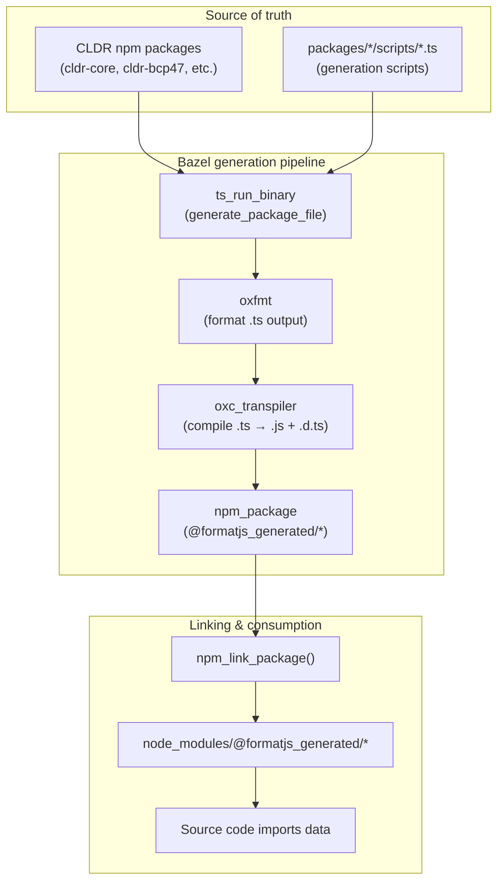

# @formatjs_generated Packages

## Overview

`@formatjs_generated` is the npm scope for all auto-generated TypeScript data packages in the monorepo. These packages contain CLDR-derived data (timezone maps, locale metadata, regex patterns, etc.) that are generated from CLDR npm packages and other data sources by TypeScript scripts.

Generated files live **only in Bazel output** — they are not checked into git. Each source package's generated files are compiled and packaged as `@formatjs_generated/<package>`, then linked into `node_modules` via `npm_link_package()`.

## Pipeline

```
Generation script (.ts)
  → ts_run_binary (runs script with --out flag)
  → oxfmt (format output)
  → oxc_transpiler (compile .ts → .js + .d.ts)
  → npm_package (package as @formatjs_generated/<name>)
  → npm_link_package (symlink into node_modules)
```



## Package Registry

All generated packages are registered in `tools/generated_packages.bzl`:

```starlark
GENERATED_PACKAGES = [
    {"name": "intl-locale", "target": "//packages/intl-locale:generated_pkg"},
    {"name": "intl-numberformat", "target": "//packages/intl-numberformat:generated_pkg"},
    # ...
]
```

The root `BUILD.bazel` calls `link_all_generated_packages()` to create `npm_link_package()` entries for each.

## Package Inventory

| Source Package | Generated Files | npm Package |
|---|---|---|
| intl-locale | calendars, character-orders, hour-cycles, numbering-systems, timezones, week-data | `@formatjs_generated/intl-locale` |
| intl-supportedvaluesof | calendars, collations, currencies, numbering-systems, timezones, units | `@formatjs_generated/intl-supportedvaluesof` |
| intl-datetimeformat | data/all-tz, data/links, supported-locales | `@formatjs_generated/intl-datetimeformat` |
| intl-numberformat | currency-digits, numbering-systems, supported-locales | `@formatjs_generated/intl-numberformat` |
| utils | currencyMinorUnits, defaultCurrencyData, defaultLocaleData | `@formatjs_generated/utils` |
| intl-getcanonicallocales | aliases, likelySubtags | `@formatjs_generated/intl-getcanonicallocales` |
| intl-durationformat | numbering-systems, time-separators | `@formatjs_generated/intl-durationformat` |
| ecma402-abstract | regex, NumberFormat/digit-mapping | `@formatjs_generated/ecma402-abstract` |
| icu-messageformat-parser | regex, time-data | `@formatjs_generated/icu-messageformat-parser` |
| intl-displaynames | supported-locales | `@formatjs_generated/intl-displaynames` |
| intl-listformat | supported-locales | `@formatjs_generated/intl-listformat` |
| intl-pluralrules | supported-locales | `@formatjs_generated/intl-pluralrules` |
| intl-relativetimeformat | supported-locales | `@formatjs_generated/intl-relativetimeformat` |
| intl-segmenter | cldr-segmentation-rules | `@formatjs_generated/intl-segmenter` |
| icu-skeleton-parser | regex | `@formatjs_generated/icu-skeleton-parser` |
| eslint-plugin-formatjs | emoji-data | `@formatjs_generated/eslint-plugin-formatjs` |
| intl-localematcher | abstract/regions | `@formatjs_generated/intl-localematcher` |

## Bazel Macros

### `generate_package_file()`

**Location:** `tools/generated.bzl`

Generates and formats a single `.ts` file for inclusion in a generated package. Same as the old `generate_src_file()` but without the `write_source_files` step — output stays in Bazel.

```starlark
generate_package_file(
    name = "timezones_gen",
    src = "timezones.ts",
    data = ["//:node_modules/cldr-bcp47"],
    tool = "//packages/intl-locale/scripts:timezones",
)
```

### `formatjs_generated_package()`

**Location:** `tools/generated.bzl`

Assembles generated files into an npm package with compiled `.js` + `.d.ts` output.

```starlark
formatjs_generated_package(
    name = "generated_pkg",
    package_name = "intl-locale",
    srcs = {
        "timezones.ts": ":timezones_gen",
        "calendars.ts": ":calendars_gen",
        "hour-cycles.ts": ":hour-cycles_gen",
        # ...
    },
)
```

Generates:
1. `package.json` with `{"name": "@formatjs_generated/intl-locale", "type": "module", "exports": {"./*": "./*"}}`
2. `oxc_transpiler` compilation of all `.ts` → `.js` + `.d.ts`
3. `npm_package` with the compiled output

### `link_all_generated_packages()`

**Location:** `tools/generated_packages.bzl`

Called from root `BUILD.bazel`. Iterates `GENERATED_PACKAGES` and calls `npm_link_package()` for each.

## Consuming Generated Packages

### Import Pattern

```typescript
// Import data
import {timezones} from '@formatjs_generated/intl-locale/timezones.js'

// Import types
import type {Calendar} from '@formatjs_generated/intl-supportedvaluesof/calendars.js'

// Nested paths work too
import {digitMapping} from '@formatjs_generated/ecma402-abstract/NumberFormat/digit-mapping.js'
```

### Bazel Dependency

Add `//:node_modules/@formatjs_generated/<package>` to your target's `deps`:

```starlark
formatjs_library(
    name = "dist",
    srcs = ["index.ts", "polyfill.ts"],
    deps = [
        "//:node_modules/@formatjs_generated/intl-locale",
        "//:node_modules/@formatjs/intl-getcanonicallocales",
    ],
)
```

### Rolldown Bundling

`@formatjs_generated/*` packages are **bundled inline** (not externalized). They contain static data that should be included in the published npm package output. The `_formatjs_package()` macro in `tools/compile.bzl` excludes `@formatjs_generated` from the rolldown `external` list.

## IDE Support

### tsconfig Path Mappings

`generate_ide_tsconfig_json()` and `packages_tsconfig()` include `@formatjs_generated/*` path mappings pointing to `bazel-bin/`:

```json
{
  "compilerOptions": {
    "paths": {
      "#packages/*": ["../../packages/*"],
      "@formatjs_generated/*": ["../../bazel-bin/packages/*/generated_pkg/*"]
    }
  }
}
```

For IDE resolution to work, the generated packages must be built at least once (`bazel build //packages/<pkg>:generated_pkg`).

### Gazelle

The custom gazelle plugin at `tools/gazelle/ts/resolve.go` resolves `@formatjs_generated/<pkg>` imports to `//:node_modules/@formatjs_generated/<pkg>` Bazel labels. These are placed in `deps` (not `project_references`) since they are npm-linked packages.

## Adding a New Generated File

### To an existing package

1. Create the generation script in `packages/<pkg>/scripts/<name>.ts` (follow conventions in `knowledge-base/010-script-conventions.md`)
2. Add a `generate_package_file()` target in `packages/<pkg>/BUILD.bazel`
3. Add the new file to the existing `formatjs_generated_package(srcs={...})` dict
4. Import from `@formatjs_generated/<pkg>/<name>.js` in source code
5. Run `bazel run //:gazelle` to update deps

### Creating a new generated package

1. Create generation script(s) in `packages/<pkg>/scripts/`
2. Add `generate_package_file()` + `formatjs_generated_package()` to `packages/<pkg>/BUILD.bazel`
3. Add entry to `GENERATED_PACKAGES` in `tools/generated_packages.bzl`
4. Run `bazel run //:gazelle` to update deps
5. Import from `@formatjs_generated/<pkg>/<name>.js` in source code

## Rust Crate Generated Files

Rust generated files (`crates/icu_messageformat_parser/regex_generated.rs`, `time_data_generated.rs`) are **not** part of this system. They continue to use `generate_src_file()` with `write_source_files` since Rust has no npm package equivalent. These files remain checked into git.

## Key Files

| File | Purpose |
|---|---|
| `tools/generated.bzl` | `generate_package_file()`, `formatjs_generated_package()` macros |
| `tools/generated_packages.bzl` | Package registry + `link_all_generated_packages()` |
| `tools/compile.bzl` | `formatjs_library()` — excludes `@formatjs_generated` from rolldown externals |
| `tools/tsconfig.bzl` | `packages_tsconfig()` — `@formatjs_generated/*` path alias for IDE |
| `tools/index.bzl` | `generate_ide_tsconfig_json()` — `@formatjs_generated/*` path mapping |
| `tools/gazelle/ts/resolve.go` | Resolves `@formatjs_generated/` imports to Bazel labels |
| `BUILD.bazel` (root) | Calls `link_all_generated_packages()` |
