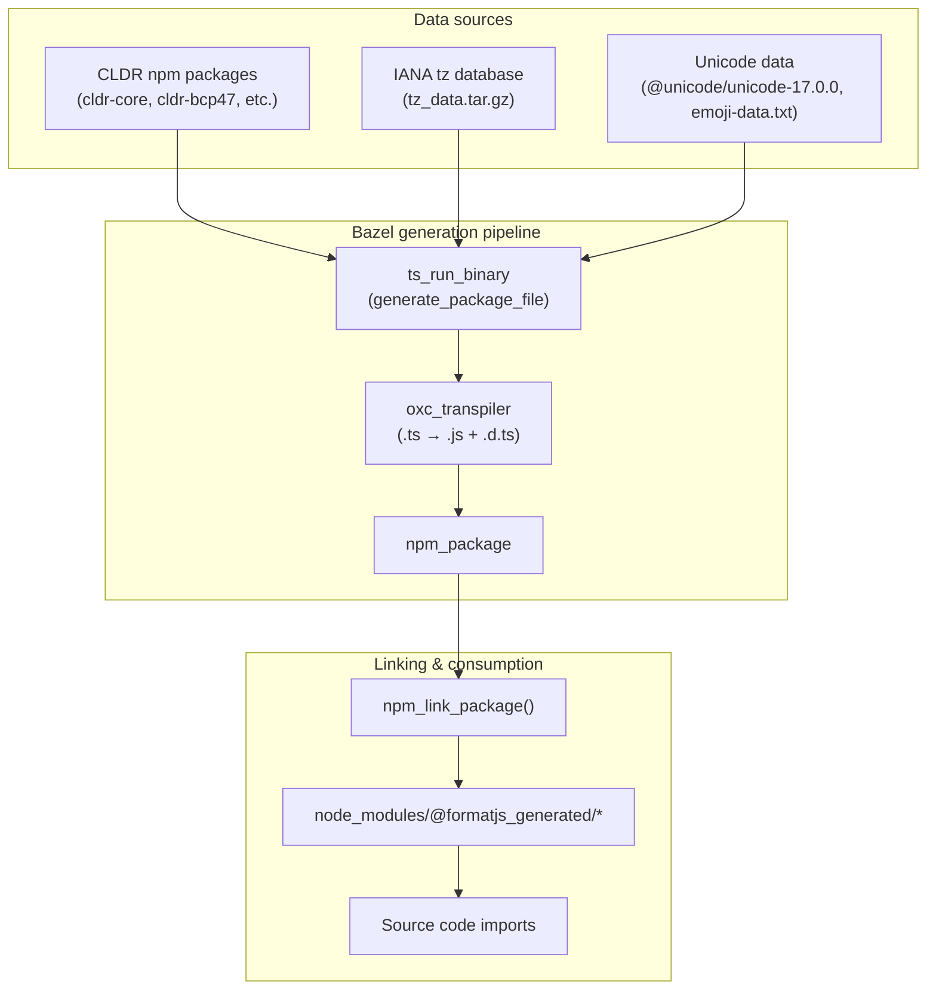

# @formatjs_generated Packages

## Overview

`@formatjs_generated` is the npm scope for auto-generated TypeScript data packages. These contain CLDR-derived data, Unicode regex patterns, IANA timezone data, etc. that are generated by TypeScript scripts from upstream data sources.

Generated files live **only in Bazel output** — they are not checked into git. They are organized into composite TypeScript projects grouped by **data source**, compiled, packaged, and linked into `node_modules` via `npm_link_package()`.

## Pipeline

```
Generation script (.ts)
  → ts_run_binary (runs script with --out flag)
  → oxc_transpiler (compile .ts → .js + .d.ts)
  → npm_package (package as @formatjs_generated/<data-source>)
  → npm_link_package (symlink into node_modules)
```



## Package Structure

Packages are organized by **data source**, not by consuming package. CLDR data is further split into sub-packages aligned with the upstream CLDR npm package groupings (`cldr-core`, `cldr-numbers-full`, `cldr-bcp47`, etc.). Package names use `.` as path delimiter.

Files within each package use subdirectories named after their origin package to avoid collisions.

### `@formatjs_generated/cldr.core` — Supplemental data, canonical names, defaults (7 files)

From `cldr-core` supplemental data and ISO 4217.

```
@formatjs_generated/cldr.core/
  intl-getcanonicallocales/
    aliases.js              # language/territory/script/variant aliases
    likelySubtags.js        # likely subtag mappings
  intl-localematcher/
    regions.js              # region groupings for locale matching
  icu-messageformat-parser/
    time-data.js            # time data for ICU message parsing
  utils/
    currencyMinorUnits.js   # ISO 4217 minor units
    defaultCurrencyData.js  # default currency per territory
    defaultLocaleData.js    # default locale data
```

### `@formatjs_generated/cldr.locale` — Locale preference metadata (6 files)

Locale-level preferences from `cldr-core`, `cldr-bcp47`, `cldr-localenames-full`, `cldr-misc-full`. All consumed by `intl-locale`.

```
@formatjs_generated/cldr.locale/
  calendars.js              # preferred calendars per territory
  character-orders.js       # character ordering per locale
  hour-cycles.js            # preferred hour cycles per territory
  numbering-systems.js      # preferred numbering systems per locale
  timezones.js              # timezones per territory
  week-data.js              # first day of week, weekend, min days
```

### `@formatjs_generated/cldr.number` — Number/currency formatting data (4 files)

From `cldr-numbers-full` and `cldr-core`. Currency and numbering system data for formatters.

```
@formatjs_generated/cldr.number/
  intl-numberformat/
    currency-digits.js      # decimal digits per currency
    numbering-systems.js    # numbering system digit mappings
  intl-durationformat/
    numbering-systems.js    # copied from intl-numberformat
    time-separators.js      # locale-specific time separators
```

### `@formatjs_generated/cldr.supported-values` — BCP47 supported value enumerations (6 files)

From `cldr-bcp47` and `cldr-numbers-full`. Exhaustive lists consumed by `intl-supportedvaluesof`.

```
@formatjs_generated/cldr.supported-values/
  calendars.js              # all BCP47 calendar types
  collations.js             # all BCP47 collation types
  currencies.js             # all ISO 4217 currency codes
  numbering-systems.js      # copied from intl-numberformat
  timezones.js              # all IANA timezone identifiers
  units.js                  # all BCP47 unit identifiers
```

### `@formatjs_generated/cldr.supported-locales` — Per-polyfill supported locale lists (6 files)

From various CLDR full packages. Each file is the set of locales a polyfill supports, derived from which locales have sufficient CLDR data.

```
@formatjs_generated/cldr.supported-locales/
  intl-datetimeformat.js    # from cldr-core, cldr-bcp47, cldr-dates-full, cldr-numbers-full
  intl-displaynames.js      # from cldr-core, cldr-dates-full, cldr-localenames-full, cldr-numbers-full
  intl-listformat.js        # from cldr-core, cldr-misc-full
  intl-numberformat.js      # from cldr-core, cldr-numbers-full, cldr-units-full
  intl-pluralrules.js       # from cldr-core
  intl-relativetimeformat.js # from cldr-core, cldr-dates-full, cldr-numbers-full
```

### `@formatjs_generated/tz` — IANA timezone database (2 files)

Data extracted from the IANA Time Zone Database (`tz_data.tar.gz` → zdump output and backward compatibility links).

```
@formatjs_generated/tz/
  all-tz.js               # zdump-processed timezone transitions
  links.js                # IANA "backward" timezone links
```

### `@formatjs_generated/unicode` — Unicode-derived data (6 files)

Regex patterns and data generated from Unicode character properties (`@unicode/unicode-17.0.0`, `emoji-data.txt`, `cldr-segments-full`).

```
@formatjs_generated/unicode/
  ecma402-abstract/
    regex.js              # from @unicode/unicode-17.0.0, regenerate
    digit-mapping.js      # digit mapping table
  icu-messageformat-parser/
    regex.js              # ICU message format regex patterns
  icu-skeleton-parser/
    regex.js              # from @unicode/unicode-17.0.0, regenerate
  eslint-plugin-formatjs/
    emoji-data.js         # from emoji-data.txt
  intl-segmenter/
    cldr-segmentation-rules.js  # from Unicode properties + cldr-segments-full
```

## Package Registry

The registry is auto-generated — **do not edit manually**:

- **`tools/generated_packages_registry.bzl`** — Auto-generated list of all `@formatjs_generated` packages. Contains `GENERATED_PACKAGES` list.
- **`tools/generated_packages.bzl`** — Imports the registry and provides `link_all_generated_packages()` helper.
- **`scripts/generate_generated_packages.sh`** — Script that regenerates the registry using `bazel query` to discover all `formatjs_generated_package` targets.

To regenerate after adding/removing a generated package:

```bash
./scripts/generate_generated_packages.sh
```

The root `BUILD.bazel` calls `link_all_generated_packages()` to link all packages into `node_modules`.

## Bazel Macros

### `generate_package_file()`

**Location:** `tools/generated.bzl`

Generates a single `.ts` file via `ts_run_binary`. Output stays in Bazel — no `write_source_files`, no formatting (generated data doesn't need it).

```starlark
generate_package_file(
    name = "timezones_gen",
    src = "timezones.ts",
    data = ["//:node_modules/cldr-bcp47"],
    tool = "//packages/intl-locale/scripts:timezones",
)
```

### `formatjs_generated_package()`

**Location:** `tools/generated.bzl`

Assembles generated files into a composite TypeScript project, compiles, and creates an npm package.

```starlark
formatjs_generated_package(
    name = "pkg",
    package_name = "cldr.locale",
    srcs = {
        "calendars.ts": ":calendars_gen",
        "character-orders.ts": ":character_orders_gen",
        "hour-cycles.ts": ":hour_cycles_gen",
        "numbering-systems.ts": ":numbering_systems_gen",
        "timezones.ts": ":timezones_gen",
        "week-data.ts": ":week_data_gen",
    },
)
```

Generates:

1. `package.json` with `{"name": "@formatjs_generated/cldr.locale", "type": "module", "exports": {"./*": "./*"}}`
2. `tsconfig.json` with `composite: true`
3. `oxc_transpiler` compilation of all `.ts` → `.js` + `.d.ts`
4. `npm_package` with the compiled output

## Consuming Generated Packages

### Import Pattern

```typescript
// CLDR locale metadata
import {timezones} from '@formatjs_generated/cldr.locale/timezones.js'
import {weekData} from '@formatjs_generated/cldr.locale/week-data.js'

// CLDR core/supplemental
import {aliases} from '@formatjs_generated/cldr.core/intl-getcanonicallocales/aliases.js'

// CLDR supported locale lists
import {supportedLocales} from '@formatjs_generated/cldr.supported-locales/intl-numberformat.js'

// CLDR supported value enumerations
import type {Calendar} from '@formatjs_generated/cldr.supported-values/calendars.js'

// Timezone data
import links from '@formatjs_generated/tz/links.js'

// Unicode/regex data
import {S_UNICODE_REGEX} from '@formatjs_generated/unicode/ecma402-abstract/regex.js'
```

### Bazel Dependency

Add `//:node_modules/@formatjs_generated/<package>` to your target's `deps`:

```starlark
formatjs_library(
    name = "dist",
    srcs = ["index.ts", "polyfill.ts"],
    deps = [
        "//:node_modules/@formatjs_generated/cldr.locale",
        "//:node_modules/@formatjs_generated/cldr.core",
        "//:node_modules/@formatjs/intl-getcanonicallocales",
    ],
)
```

### Rolldown Bundling

`@formatjs_generated/*` packages are **bundled inline** (not externalized). They contain static data that should be included in the published npm package. The `_formatjs_package()` macro in `tools/compile.bzl` excludes `@formatjs_generated` from the rolldown `external` list.

## IDE Support

### tsconfig Path Mappings

`packages_tsconfig()` and `generate_ide_tsconfig_json()` include `@formatjs_generated/*` path mappings pointing to `bazel-bin/`:

```json
{
  "compilerOptions": {
    "paths": {
      "#packages/*": ["../../packages/*"],
      "@formatjs_generated/*": ["../../node_modules/@formatjs_generated/*"]
    }
  }
}
```

Generated packages must be built at least once for IDE resolution (e.g., `bazel build //packages/generated/cldr/locale:pkg`).

### Gazelle

Root `BUILD.bazel` uses native Gazelle `resolve_regexp` to resolve
`@formatjs_generated/<pkg>/...` imports to
`//:node_modules/@formatjs_generated/<pkg>` Bazel labels, placed in `deps`.

## Adding a New Generated File

### To an existing data-source package

1. Create the generation script in `packages/<consuming-pkg>/scripts/<name>.ts` (follow `knowledge-base/010-script-conventions.md`)
2. Add a `generate_package_file()` target in the data-source package's `BUILD.bazel`
3. Add the new file to `formatjs_generated_package(srcs=[...])`
4. Run `./scripts/generate_generated_packages.sh` to update the registry
5. Import from `@formatjs_generated/<data-source>/<origin-pkg>/<name>.js`
6. Run `bazel run //:gazelle` to update deps

### Creating a new data-source package

1. Create `BUILD.bazel` with `generate_package_file()` + `formatjs_generated_package()`
2. Run `./scripts/generate_generated_packages.sh` to update the registry
3. Run `bazel run //:gazelle` to update deps

## Rust Crate Generated Files

Rust generated files (`crates/icu_messageformat_parser/regex_generated.rs`, `time_data_generated.rs`) are **not** part of this system. They continue to use `generate_src_file()` with `write_source_files` and remain checked into git.

## Key Files

| File                                     | Purpose                                                                       |
| ---------------------------------------- | ----------------------------------------------------------------------------- |
| `tools/generated.bzl`                    | `generate_package_file()`, `formatjs_generated_package()` macros              |
| `tools/generated_packages_registry.bzl`  | Auto-generated package registry (`GENERATED_PACKAGES` list)                   |
| `tools/generated_packages.bzl`           | `link_all_generated_packages()` helper                                        |
| `scripts/generate_generated_packages.sh` | Script to regenerate the registry via `bazel query`                           |
| `tools/compile.bzl`                      | `formatjs_library()` — excludes `@formatjs_generated` from rolldown externals |
| `tools/tsconfig.bzl`                     | `packages_tsconfig()` — `@formatjs_generated/*` path alias for IDE            |
| `tools/index.bzl`                        | `generate_ide_tsconfig_json()` — `@formatjs_generated/*` path mapping         |
| `BUILD.bazel` (root)                     | Calls `link_all_generated_packages()`                                         |
