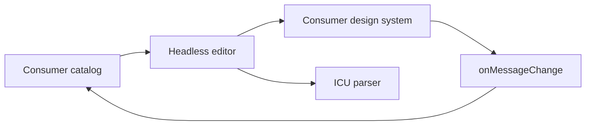

# Headless editor and visual tests

`packages/editor/index.tsx` exposes `useMessageEditor` and a render-prop `Editor`.
The core owns selection/search and ICU parse results. Message data is controlled;
consumers apply `onMessageChange` and own persistence, providers, markup, and styles.
`Message` exposes the full AST or parse error through a render function.

`demo.tsx` is a separate StyleX consumer with localized, labeled native controls.
`design-system/` owns theme tokens and reusable controls. Vite compiles StyleX
through `@stylexjs/unplugin` before the React plugin. Visual tests cover editing,
invalid ICU with keyboard focus, and a narrow RTL layout.
The core imports neither this view nor React Intl. Material UI and React 17 are
removed. `//packages/editor:unit_test` checks controlled updates, navigation,
invalid ICU, empty catalogs, and custom rendering without providers.

`//packages/editor/vrt:visual_test` exercises the example on React 19 with root
npm dependencies and current workspace React Intl/parser sources. There is no
separate npm workspace or lockfile. The root lock pins Playwright to match the
browser image. Bazel workspace npm links supply current package builds; no published formatter
versions are duplicated in the VRT setup.

The browser target is manual, local, and uncached. It requires Docker and uses
`rules_web_e2e` with a pinned Linux amd64 image. The custom `server.ts` adapter
owns startup/cleanup; `shell.tsx` owns the IntlProvider. Inputs, environment, and
browser networking are isolated by the rules runtime. Host plugins/tests remain
trusted code outside full Bazel filesystem sandboxing.

Run `.update` only for intentional visual changes, review the PNGs, then run
comparison. See `packages/editor/vrt/README.md` for exact commands.

VRT TypeScript settings come from `tools/tsconfig.bzl`; Bazel declares the source
inputs. Bazel generates a runtime-only `package.json` containing `{"type":"module"}`
so Playwright loads the `.ts` config as ESM. It declares no dependencies.
