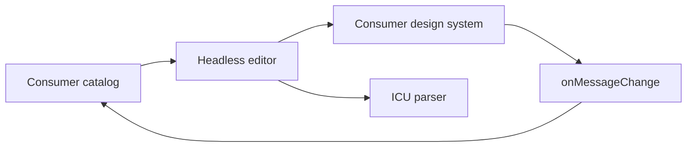

# Headless editor and visual tests

`packages/editor/index.ts` exposes `useMessageEditor` and a render-prop `Editor`.
The core owns selection, conjunctive general/description search, and ICU parse
results. Message data is controlled;
consumers apply `onMessageChange` and own persistence, providers, markup, and styles.
`Message` exposes the full AST or parse error through a render function.



`demo/demo.tsx` is a separate StyleX consumer with localized, labeled native controls.
`design-system/` owns theme tokens and reusable controls. Vite compiles StyleX
through `@stylexjs/unplugin` before the React plugin. Visual tests cover editing,
invalid ICU with keyboard focus, and a narrow RTL layout.
Reusable workflow behavior also includes guarded grid/list preference persistence,
all-selected/any-missing status helpers (undefined values remain missing), parser-backed structural-preview
eligibility, width-aware autosizing textarea bounds, renderable locale labels, and opt-in exact
copy controls for catalog and location metadata. Product design systems remain
adapters at these seams; fetching, debounce/cancellation, locale naming policy, and
storage/persistence backends remain consumer-owned.
The core imports neither this view nor React Intl. Material UI and React 17 are
removed. `//packages/editor:unit_test` checks controlled updates, navigation,
invalid ICU, empty catalogs, and custom rendering without providers.

`//packages/editor/vrt:visual_test` exercises the example on React 19 with root
npm dependencies and current workspace React Intl/parser sources. There is no
separate npm workspace or lockfile. The root lock pins Playwright to match the
Chromium archive. Bazel workspace npm links supply current package builds; no published formatter
versions are duplicated in the VRT setup.

E2E, component interactions, and VRT all use a declared `linux_chromium_runtime`
and execute in actiond Linux amd64 actions. Chromium/Node, the selected Linux library closure, and fonts are checksum-pinned
Bazel inputs. The optional preset omits unrelated OS packages and GPU drivers. No host browser cache,
FFmpeg download, apt setup, or container image is needed for these suites.
The browser CI script starts the actiond v0.0.7 release (`4b767e8`), downloaded
and checksum-verified by `//tools:actiond`,
and includes its binary SHA256 in remote execution properties to separate cached
results across worker/kernel changes. See [browser setup](../packages/editor/vrt/README.md).
The custom `server.ts` adapter serves built assets; `shell.tsx` owns the IntlProvider.
CI runs the standard VRT comparison with `matching.ts`; it captures screenshots
without applying them to source baselines. A separate capture/update validation
pass is not needed.

Run `.update` only for intentional visual changes, review the PNGs, then run
comparison. See `packages/editor/vrt/README.md` for exact commands.

VRT TypeScript settings come from `tools/tsconfig.bzl`; Bazel declares the source
inputs. Bazel generates a runtime-only `package.json` containing `{"type":"module"}`
so Node loads compiled specs, server code, and matching policy as ESM. It declares no dependencies.

`useTranslationEditor` composes `useMessageEditor` for multi-locale workflows.
Draft state and in-flight save guards use `[message ID, locale]` keys. Completion
updates the submitted key and baseline, preserving newer edits and other selections.
Controlled catalog updates refresh clean drafts without overwriting dirty text.
Locale fallback and clamped pagination handle asynchronously changing inputs.
`validation.ts` compares recursive ICU contracts per branch; additional plural
categories inherit `other`, rather than multiplying a global placeholder count.

`core.tsx` owns the original headless API; `index.tsx` exports it alongside the
workflow and validation APIs. `demo/demo.tsx` shares an optional StyleX `EditorView`
with `demo/workflow-demo.tsx`. Workflow state has no dependency on either UI module.
VRT's `?workflow=1` fixture exercises controlled persistence, filters, saved-state
feedback, and desktop/narrow RTL screenshots. Existing demo baselines remain in
place to catch regressions in the shared view.

Gazelle maintains source and dependency lists in the headless, demo, and VRT
Bazel packages. The demo is a separate internal library. VRT maps generated
library and test rules to local `vrt_library` / `vrt_test` wrappers that preserve
raw sources for the bundle build, typecheck them, and emit JavaScript for the
server, matching policy, and specs. Vite runs only in the sandboxed `:bundle`
action; browser tests consume its static output.
No editor package disables Gazelle.

`@formatjs/editor` participates in the pnpm workspace, Bazel distribution
registry, and Release Please npm publishing. Its public `index.ts` bundles
headless APIs and declarations; React 19 is a peer dependency. Demo and VRT
packages are development-only and are excluded from the npm artifact.

The headless editor's initial release is `1.2.0`, configured with
`initial-version`. Until that release lands, its Release Please manifest entry
is `0.0.0` (unreleased). The manifest records released versions, not the next
target: setting it to `1.2.0` makes Release Please send the nonexistent
`@formatjs/editor@1.2.0` tag to GitHub's release-notes API as `previous_tag`.
Release Please updates the manifest after the release PR lands.

## Browser interaction tests

Write native Playwright `*.spec.ts` files in `packages/editor/vrt/`. The
runner supplies `baseURL`, so specs can use `page.goto('/')`,
accessible locators, clicks, and web-first assertions. VRT captures are generated from the `.visual.tsx` module. Both targets use the built application. E2E, component tests, and VRT use the same declared Linux runtime in actiond; provisioning is documented in the browser setup guide.

```sh
bash .github/scripts/actiond-vrt.sh
```

E2E covers editing, search, selection, copy/clear, ICU error recovery, locale
drafts, and saving. It uses checksum-pinned Chromium and declared fixtures in a native Bazel test action on isolated Linux. Bazel retries and repeated runs launch Chromium again. See [browser setup](../packages/editor/vrt/README.md).
CI should explicitly select both `e2e_test` and `visual_test`. Failures retain
JUnit, screenshots, and Playwright traces in undeclared test outputs.

## Component browser tests

`component_test` runs Playwright 1.63 native `mount()` specs for the real editor. The typed
`editor.visual.tsx` uses the existing provider shell and demo; `gallery.tsx` owns
mount/update/unmount. The tests check provider updates without losing a draft,
clear, ICU validation, and isolation between mounts.

`component_browser_test` consumes the built gallery and compiled component specs.
E2E uses a compiled custom server adapter serving the same built app. The runtime
selects compiled `*.browser.spec.js` separately from E2E `*.spec.js` and generated
VRT captures. CI should explicitly run all three
browser targets through the `Editor browser tests` workflow. Screenshot baselines and updates remain in `visual_test`.

The default export of `editor.visual.tsx` is a `ComponentVisualModule`: it declares
renderable cases, browser-side capture hooks, and VRT options. The gallery registers
that module with `installVisualGallery`. The shared runtime generates all six
screenshot tests; no `editor.visual.spec.ts` is maintained. Interaction tests stay
in `editor.browser.spec.tsx`, and the existing PNG names remain explicit in the
visual declarations.

## Built browser input interface

The rules' `browser_shell` describes `:bundle` plus `gallery.html`.
`component_test` and `visual_test` consume that shell. `e2e_test` consumes
`:editor_server`, whose compiled adapter serves the built assets. The shared
`:playwright` target groups client packages and browser pin. `:vrt_matching`
sets screenshot comparison independently from the visual modules' render options.

The build action owns Vite and StyleX configuration, uses declared workspace
package links, disables dotenv discovery, and depends on strict typechecks.
The browser runtime never transpiles source or starts a bundler. See
`packages/editor/vrt/README.md` for commands and migration details.

Bazel's native test-launcher utilities are built from pinned sources with hermetic
LLVM and musl by rules_web_e2e; they require no Ubuntu test-tools package bundle.
