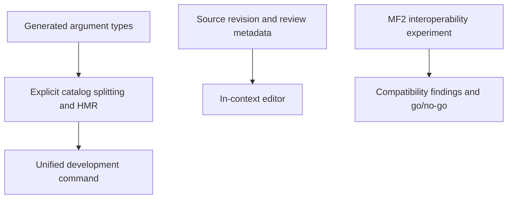

# Feature opportunities

Status: proposal, not a committed roadmap. Analysis dated September 12, 2026.

Make FormatJS easier to adopt, safer to author, and cheaper to ship. Build on the
existing ICU parser, Rust CLI, unplugin, polyfills, and headless editor. Priorities
below are product judgments from source and documentation review, not measured
user demand or comparative benchmarks.

## Similar OSS projects

| Project                                                         | Relevant strength                                                                                                                        | Opportunity for FormatJS                                     |
| --------------------------------------------------------------- | ---------------------------------------------------------------------------------------------------------------------------------------- | ------------------------------------------------------------ |
| [Lingui](https://lingui.dev/)                                   | Compile-time macros and integrated extraction/catalog workflow                                                                           | Unify the development workflow around existing tools         |
| [Paraglide](https://paraglidejs.com/architecture)               | Generated message functions, tree shaking, translation HMR                                                                               | Generate typed message modules and selectively load catalogs |
| [i18next](https://www.i18next.com/overview/typescript)          | Typed selectors and scalable catalog typing                                                                                              | Check arguments per message without slowing large projects   |
| [next-intl](https://next-intl.dev/docs/workflows/typescript)    | Message argument types and [server/client integration](https://learn.next-intl.dev/chapters/03-translations/02-server-client-components) | Reduce server setup and generate stronger types              |
| [Tolgee](https://docs.tolgee.io/js-sdk/5.x.x)                   | In-context editing and screenshots                                                                                                       | Connect the existing editor to running applications          |
| [messageformat](https://github.com/messageformat/messageformat) | MF2 runtime, MF1 migration, Fluent interoperability                                                                                      | Offer an optional MF2 migration path                         |
| [Fluent](https://projectfluent.org/fluent/guide/terms.html)     | Translator-controlled terms and grammatical variants                                                                                     | Improve terminology tooling and translation context          |

These projects solve different parts of localization. The comparison identifies
useful capabilities, not an overall ranking. FormatJS already supports strict
message IDs, a server-safe React Intl entry point, pseudolocales, catalog checks,
and a headless translation editor. Extend those instead of duplicating them.

## 1. Generate message argument types

**First priority.** Strict IDs catch unknown messages, but `formatMessage` values
remain broad records. Generate contracts from extracted ICU ASTs:

- Required argument names and numeric plural arguments.
- Rich-text callback requirements.
- Autocomplete and compile errors tied to the message ID.
- Explicit overrides where syntax cannot determine application intent.

For example, a message containing `{count, plural, one {# item} other {# items}}`
requires a numeric `count`. Omitting it should fail TypeScript before formatting.
An unformatted argument does not imply a string-only application contract, and a
`select` with an `other` branch does not necessarily imply a closed enum.

Start with opt-in generated declarations or typed descriptors. Keep existing
calls compatible. Cover rich-text return types, fallback messages, dynamic IDs,
and catalogs large enough to expose TypeScript performance problems.

Success: incorrect arguments fail type checking; valid existing calls still work;
generation is deterministic; compiler and editor costs remain acceptable.

## 2. Selectively load catalogs

**Largest delivery opportunity.** Extend unplugin with generated catalog modules,
locale loaders, and translation HMR. Start with explicit catalog boundaries;
infer reachable messages from bundler graphs later.

A checkout page should load checkout translations for the selected locale plus
shared messages. Dynamic IDs need declared fallback catalogs. Shared chunks,
locale fallback, SSR hydration, and messages reached through wrappers need clear
ownership rules before automatic splitting can be reliable.

Paraglide demonstrates compiler-driven message elimination. Test whether FormatJS
can offer similar benefits while retaining ICU catalogs and React Intl calls.
Measure transferred bytes and load latency on representative applications; do
not promise bundle savings from architecture alone.

Success: unrelated messages stay out of a route's initial payload; locale changes
and fallback still work; development edits update without a full reload.

## 3. Track source changes and translation review

The CLI already checks missing/extra keys and structural compatibility. The
editor already manages drafts and persistence. Add a semantic review lifecycle:

- Store the source revision or hash associated with each translation.
- Mark translations `needs-review` when source text changes under a stable ID.
- Show the source diff beside the saved translation.
- Preserve review metadata through supported catalog round trips.
- Expose persistence revisions for stale-save detection.

A translation can remain structurally valid after its meaning becomes outdated.
Keep source revision separate from translation revision: they answer different
questions. Define behavior for generated IDs, description-only changes, and
formats that cannot preserve metadata. A sidecar is one option to evaluate.

Success: source edits reliably flag affected translations; unchanged translations
retain review state; conflicting saves cannot silently overwrite newer work when
the persistence adapter supports revision checks.

## 4. Add in-context translation tools

Provide a development-only overlay: select a rendered message, open
`@formatjs/editor`, inspect its source location, edit, and preview immediately.
Start with explicit `FormattedMessage` instrumentation. String-only calls,
attributes, repeated messages, and rich-text fragments need separate mapping.

Add screenshot/context export after message selection works. Keep persistence
adapter-based and ensure instrumentation is absent from production builds.
Tolgee shows the value of editing with UI context; FormatJS already has the
editor primitives to build on.

Success: a developer can find and edit a rendered message without searching a
catalog manually, with no production payload cost when disabled.

## 5. Unify the development command

A proposed `formatjs dev` command would coordinate incremental extraction,
catalog validation, type generation, compilation, HMR, and source-linked
diagnostics. Use one configuration for source locale, catalogs, output, and
validation policy.

Build on the existing CLI and unplugin. Keep generated output out of watched
inputs, handle deleted sources, and preserve translator-owned edits. Deliver
this after the underlying type generation and catalog-loading contracts settle.

Success: a new project gets extraction and live translation updates with minimal
wiring; incremental updates match a clean run.

## 6. Explore MF2 interoperability

Run a separate experiment for catalog conversion, compatibility diagnostics, and
side-by-side formatting comparisons. Evaluate reusing `messageformat` before
building another runtime. Preserve MF1 behavior and keep MF2 opt-in.

Migration must explicitly handle skeletons, rich text, custom formatting, and
unsupported conversions. Fluent's grammatical terms also deserve exploration;
generic string substitution does not preserve their linguistic behavior.

Success: a documented compatibility matrix and a representative conversion
corpus establish what can migrate faithfully. A new production runtime is a
later decision, not the experiment's default outcome.

## Suggested sequence

Start with types, then explicit catalog splitting/HMR, then source-review
tracking. Follow with the development command and in-context editor. Keep the
MF2 experiment independent because its compatibility commitment is larger.

Before expanding each feature, validate it against a small application and a
large catalog, then collect feedback from maintainers of real consuming apps.
Bundle budgets, differential fuzzing, and browser coverage remain useful
supporting work for these features.

## Existing implementation references

- [Runtime types](../packages/intl/types.ts)
- [Strict message ID example](../examples/strict-message-types/src/App.tsx)
- [Unplugin](../packages/unplugin/README.md)
- [CLI verification and pseudolocales](../docs/src/docs/tooling/cli.mdx)
- [Next.js App Router guide](../docs/src/docs/guides/nextjs-app-router.mdx)
- [Headless editor and translation workflow](../packages/editor/README.md)
