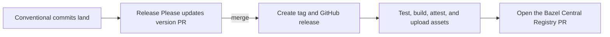

# Releasing

Release Please keeps a version bump PR current from Conventional Commits. Merge
that PR to publish.



## Setup

Two repository secrets are required:

- `GH_RELEASE_TOKEN`: Classic PAT with `repo` and `workflow` scopes. Release
  Please uses it so tag pushes trigger `release.yaml`.
- `BCR_PUBLISH_TOKEN`: Classic PAT with `repo` and `workflow` scopes. Its account
  must be able to push to `formatjs/bazel-central-registry` and open the
  upstream PR.

Set secrets interactively so tokens do not enter shell history:

```sh
gh secret set GH_RELEASE_TOKEN --repo formatjs/rules_formatjs
gh secret set BCR_PUBLISH_TOKEN --repo formatjs/rules_formatjs
```

## Normal release

Before merging the Release Please PR, confirm `main` CI and Verify Hooks are
green, no release run is active, and the proposed version is expected. A `fix`
normally produces a patch, a `feat` produces a minor, and a breaking change
produces a major.

```sh
gh run list --repo formatjs/rules_formatjs --workflow ci.yaml --branch main --limit 1
gh run list --repo formatjs/rules_formatjs --workflow verify-hooks.yml --branch main --limit 1
gh run list --repo formatjs/rules_formatjs --workflow release-please.yml --limit 5
gh release list --repo formatjs/rules_formatjs --limit 5
```

Merge the Release Please PR. That merge is explicit approval of its version,
including a major bump. Release Please creates the tag and GitHub release. The
tag triggers `release.yaml`, which builds assets, creates attestations, updates
the release, and opens the BCR PR.

```sh
gh run list --repo formatjs/rules_formatjs --workflow release.yaml --limit 1
gh run watch RUN_ID --repo formatjs/rules_formatjs --exit-status
gh release view TAG --repo formatjs/rules_formatjs
```

Completion means the tag points at the Release Please merge, the GitHub release
contains source and docs archives, attestations exist, and the BCR PR is open.

## Recovery

- If the Release Please PR is missing or stale, dispatch
  `release-please.yml` on `main`.
- If the tag exists but assets or attestations are missing, dispatch
  `release.yaml` with that tag.
- If the GitHub release exists but BCR publication failed, dispatch
  `publish.yaml` with that tag.
- If the BCR push rejects its token, rotate `BCR_PUBLISH_TOKEN`, then retry
  `publish.yaml`. Do not rerun Release Please or create another tag.

```sh
gh workflow run release-please.yml --repo formatjs/rules_formatjs --ref main

gh workflow run release.yaml \
  --repo formatjs/rules_formatjs \
  --ref main \
  -f tag_name=TAG

gh workflow run publish.yaml \
  --repo formatjs/rules_formatjs \
  --ref main \
  -f tag_name=TAG
```

Do not invent a version or push a tag. Keep `MODULE.bazel` version blank;
Release Please updates `version.txt`, while the BCR publisher sets the module
version in its registry PR.
